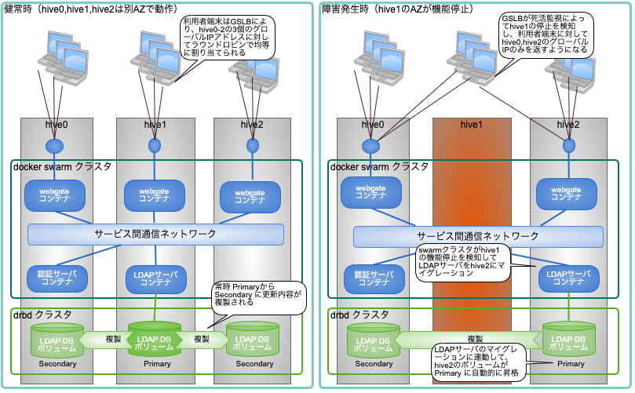

# hive-builder コード例

このツールは hive-builder により実装されており、DNS のサイトを構築できます。
hive-builder の機能については、ドキュメント https://hive-builder.readthedocs.io/ja/latest/ を参照してください。

# hive-builder の概要

hive-builder は複数台のサーバにまたがって docker コンテナを運用するハイパーコンバージドなサイトを構築するためのツールです。Kubernetes を使用せず docker swarm mode によるクラスタ機能と drbd9 によるディスク冗長化機能を使用することで、シンプルな構成でサイトを構築できます。 hive は巣箱の意味で、マイクロサービスの群れ(docker swarm)を収容し、これを運用管理します。

- コントローラを必要とせず、 hive を構成するサーバ（3台以上）が選挙によってリーダを選出する方式により split brain を防ぎます
- docker swarm クラスタを構築することで、高い可用性を確保できます
- drbd でディスクをミラーリングすることで、データボリュームを持つコンテナもマイグレーションできます
- コマンドを1回起動するだけでAWSなどの IaaS 上にサイトを構築できます
- ansible の role でコンテナの構築内容を記述できます
- サイトの初回起動時に初期データをロードできます
- サイト内にプライベートなリポジトリサーバを持ち、コンテナイメージを保存します
- サイト内にZabbix サーバを持ち、稼働を監視します
- 1個のインベントリから3段階のステージングに分けて環境を構築できます

# 物理構成
構築するサイトは 4 台の EC2 インスタンスからなり、3つの可用性ゾーンに分散されて配置されます。

- AWS 東京リージョンに仮想マシン4台を配置して冗長負荷分散で構成
- ディスクミラーリングでデータを複製同期してデータの保全性を確保
- hive0, hive1, hive2 の3台でクラスタ組むことによって、1個の可用性ゾーンで障害が発生してもサービスを継続可能
- 各サービスを docker コンテナで実装し、hive3 にコンテナイメージのリポジトリを置いているためシステムイメージバックアップ不要
- ansible でサーバを自動的に構築することで構築コストを低減
- ansible のコードを git によって版管理することでサーバのパラメータの変更を可視化して管理（パラメータシート不要）
- hive3にZabbix を配備し、サーバ- コンテナの健常性を監視
- hive3で各サービスからデータの論理バックアップを採取

以下にその様子を示します。

# 冗長化の仕組み

コンテナ収容サーバはリーダ選出選挙で高い可用性を確保するために3台以上配備する必要があります。 docker swarm mode と drbd9 の機能で高可用性を実現します。コンテナ収容サーバで構成されるクラスタを hive と呼びます。 以下にその仕組が動作する際の共同について、webgate、認証サーバ(am)、LDAPサーバを例として説明します。

1. 利用者が認証サービスにアクセスしようとすると、GSLBが hive0-2の3個のグローバルIPをラウンドロビンで均等に返すため、負荷分散してアクセスが振り分けられる
1. 利用者端末から、hive0,hive1,hive2 のどれかのwebgateコンテナで受信したHTTPリクエストはサービス間通信ネットワークを通じて認証サーバに転送される
1. サービス間通信ネットワークはサーバ間を超えた仮想ネットワークで、認証サーバコンテナがどのサーバで稼働しているかにかかわらず適切にルーティングされる
1. 認証サーバコンテナからLDAPサーバコンテナへはサービス間通信用の仮想ネットワークを通じて行われる
1. LDAPサーバコンテナが書き込むディスクの内容は、DRBDクラスタの仕組みにより、 PrimaryからSecondary に常時更新内容が複製される
1. ここで、たとえば、hive1 の AZ で障害が発生した場合は、GSLBが死活監視によってhive1の停止を検知し、利用者端末に対してhive0,hive2のグローバルIPのみを返すようになる
1. swarmクラスタがhive1の機能停止を検知してLDAPサーバコンテナをhive2にマイグレーション
1. LDAPサーバコンテナのマイグレーションに連動して、hive2のボリュームがPrimary に自動的に昇格し hive2 で書き込みが可能となる

# リポジトリサーバ
リポジトリサーバは以下の4つの機能を提供します。

リポジトリサービス：コンテナイメージを保持し、コンテナ収容サーバに配信する

稼働監視サービス：コンテナ収容サーバの健常性を監視する

バックアップサービス：日次バッチでコンテナからバックアップを採取する

ログ収集サービス：コンテナからログを収集してログファイルを作る

リポジトリサーバ自身が機能停止しても、hive はサービスを提供し続けることができます。
また、hive-builder で短時間で再構築できるため、バックアップを取る必要もありません。

# サービス一覧
以下にサービスの一覧を示します。

# GSLB
GSLBは AWS の ALB のようなプロキシ型のロードバランサに比べて以下のメリットがある

- グローバルIPの付け替え＋経路制御のような複雑な仕組みを経ないため障害耐性が高い（AWS の ALB などでは AZの障害発生時のフェールオーバがうまく行かなかったというようなことも発生している）​
- AWS の  route53 を使用して構成することも可能であるが、OSS PowerDNS のコンテナで実装することで直接サブドメインの委任を設定し、無償で実装する
- サブドメインの委任により Lets encrypt のサーバ証明書の自動更新を実装できる
-  Google Domains のような Dynamic DNS を使用することで  Elastic IP を自動的に登録できる

# サイトの自動構築

サイトの構築は、以下の7つのフェーズを順に実行することで行われます。

|フェーズ名          |対象                |内容                                  |
| ----------------- | ----------------- | ------------------------------------|
|build-infra        |ホスト,ネットワーク   |ホストとネットワークを作成し、環境を構築する|
|setup-hosts        |ホスト              |ホストを設定する                       |
|build-images       |コンテナイメージ      |コンテナイメージをビルドする             |
|build-networks     |内部ネットワーク      |内部ネットワークを構築する               |
|build-volumes      |ボリューム           |ボリュームを構築する                    |
|deploy-services    |サービス            |サービスを配備する                      |
|initialize-services|サービス            |サービスを初期化する                    |

以下にフェーズごとの動作を図示します。

# 利用の前提条件
このツールを使用するためには、以下のものが必要です。

- ユニリタ社製品をユニリタソフトウェア配布センタからダウンロードするためのクライアント証明書
- mother マシンとなるコンピュータ（詳細後述）
- github, dockerhub, yum, PyPI, npm などのリポジトリに http/https でアクセスできるネットワーク環境
- dockerhub のアカウント
- （private環境を構築する場合）Mac OS か Windows 10 のパソコンで 32 GBytes以上のメモリ、100GBytes 以上の空き容量があるもの
- （production/staging ステージの環境を構築）AWS のアカウント
- （production/staging ステージの環境を構築）DNSのゾーンを委任可能なサブドメイン（詳細後述）
- （production/staging ステージの環境を構築）AWSの上限数について、VPC数1個、EC2インスタンス数4個、ElasticIP数4個が確保できること

## mother マシン
mother マシンの OS は、CentOS, Windows Subsystem for Linux, Mac OS, Ubuntu などの環境で以下を満たしている必要があります。

- openssl コマンドが利用できること
- pip が利用できること
- python 3.8 以上が利用できること
- git コマンドが利用できること
- docker コマンドが利用できること
- インストールの手順を示します。 OSごとにインストール方法が異なる手順もありますので注意してください。

### Windows の場合の必要スペック
- メモリ 8G 以上（vagrant-VirtualBoxによる個人開発環境にトライする場合は24G以上）
- WLS がインストールされていること（WLS1, WLS2 のいずれでも良い）
- WLS環境に python, git, docker-cli などをインストールできること

### MacOSの場合の必要スペック
- メモリ 8G 以上（vagrant-VirtualBoxによる個人開発環境にトライする場合は24G以上）
- python3, git, docker desktop などをインストールできること

### Linux/Raspberry Piの場合の必要スペック
- メモリ4G以上
- ヘッドレス/リモートの場合は、そこに ssh でログインする端末が別途必要

## サブドメインの委任
最後の項目のサブドメインについて、親ドメインを Google Domains で管理することが推奨されます。
それ以外のドメインから委任する場合については、DDNS によるグローバルIPの自動登録ができませんので、委任先を手動で登録する手順が必要となります。
詳細については構築ガイドを参照してください。

# 環境構築手順
hive-builder では、 private, staging, production の３段階のステージングが可能です。
ステージングごとの構築方法を以下に示します。

| ステージ   | 構築ガイド        　　　　　　　　　　　　　　　　　　　　　　　　　　        |
| ---------- | ------------------------------------------------------------------- |
| private    | [CITSIDaaS 構築ガイド(privateステージ版)](docs/BUILD-private.md)    　 |
| staging    | [CITSIDaaS 構築ガイド(stagingステージ版)](docs/BUILD-staging.md)   　  |
| production | [CITSIDaaS 構築ガイド(productionステージ版)](docs/BUILD-production.md) |

# git リポジトリの運用
このリポジトリは [github flow](https://gist.github.com/Gab-km/3705015) に基づいて管理されています。詳しくは[github flow 運用ポリシー](docs/GITHUB-FLOW.md)を参照してください。